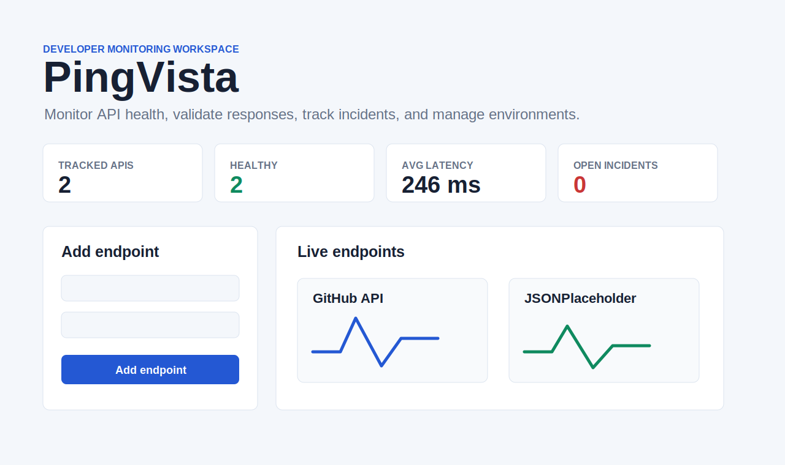

# PingVista

PingVista is an open-source API monitoring dashboard for developers. It helps you check endpoints, track latency, validate responses, review incidents, export reports, and optionally run checks through a small Node.js backend.



## Current Status

PingVista is ready for local use, public demos, and self-hosted deployments. It can run as a browser-only tool for free, or with the Node backend for server-side checks, webhook alerts, health reporting, and optional Supabase Auth/PostgreSQL storage.

## Features

- Demo mode with sample endpoints, latency history, and an example resolved incident
- Manual checks for one endpoint or all endpoints
- Browser-based automatic monitoring
- Optional Node backend checks
- Optional backend scheduler while the Node service is running
- Optional Supabase Auth and PostgreSQL persistence
- Per-user endpoints, checks, incidents, and settings in Supabase mode
- Endpoint groups for Production, Staging, and Development
- HTTP methods: `GET`, `POST`, `PUT`, `PATCH`, and `DELETE`
- Custom headers and JSON request bodies
- Expected status and response body validation
- Latency charts built with SVG
- Uptime, status, latency, and incident summaries
- Incident open/recovery tracking
- Webhook alerts for incident and recovery events
- Search and filters by status or group
- CSV report export
- JSON backup/import
- Dark mode
- Public deployment banner and clear free-hosting limitations
- Backend health endpoint at `/api/health`
- Security validation for public URL checks
- Rate limits, endpoint limits, and request body limits
- GitHub Actions CI for syntax and security tests

## Quick Start

### Browser-only mode

Open `index.html` in a modern browser.

This mode is fully free. It stores data in `localStorage` and runs checks from the browser, so some APIs may fail because of CORS.

### Backend mode

```bash
npm start
```

Then open:

```text
http://127.0.0.1:4175
```

Backend mode stores local data in:

```text
data/pingvista-db.json
```

### Supabase mode

1. Create a Supabase project.
2. Run `supabase/schema.sql` in the Supabase SQL editor.
3. Copy `.env.example` to `.env`.
4. Fill these values:

```env
SUPABASE_URL=
SUPABASE_ANON_KEY=
SUPABASE_SERVICE_ROLE_KEY=
SCHEDULER_INTERVAL_MS=300000
```

When these variables are present, PingVista stores endpoints, checks, incidents, and settings per signed-in user.

## Useful Commands

```bash
npm start
npm run check
npm run test:security
```

## Health Check

The backend exposes:

```text
GET /api/health
```

It returns service status, storage mode, scheduler status, Supabase availability, and active safety limits.

## Free Deployment

PingVista can be deployed for free as a public demo:

- Frontend: GitHub Pages, Vercel Hobby, Netlify Free, or Render Static Site
- Backend: optional Render/Railway free or trial service
- Database/Auth: Supabase Free

Read the full guide:

```text
docs/FREE_DEPLOYMENT.md
```

## Self-Hosting

For real monitoring, self-host the backend so scheduled checks continue while your browser is closed.

Read:

```text
docs/SELF_HOSTING.md
```

## Project Structure

```text
PingVista/
├── .github/workflows/ci.yml
├── assets/
│   ├── pingvista-og.svg
│   └── pingvista-screenshot.svg
├── data/
├── docs/
│   ├── FREE_DEPLOYMENT.md
│   └── SELF_HOSTING.md
├── supabase/
│   └── schema.sql
├── tests/
│   ├── rate-limit.test.js
│   └── security-validation.test.js
├── .env.example
├── CONTRIBUTING.md
├── LICENSE
├── README.md
├── ROADMAP.md
├── SECURITY.md
├── index.html
├── package.json
├── script.js
├── server.js
└── styles.css
```

## Limitations

- Browser-only checks are affected by CORS.
- Free hosting may sleep, pause, or limit background checks.
- The backend scheduler only runs while the Node service is running.
- Supabase credentials are required for real user-owned cloud persistence.
- PingVista is not a replacement for enterprise observability platforms yet.

## License

MIT License. See `LICENSE`.
